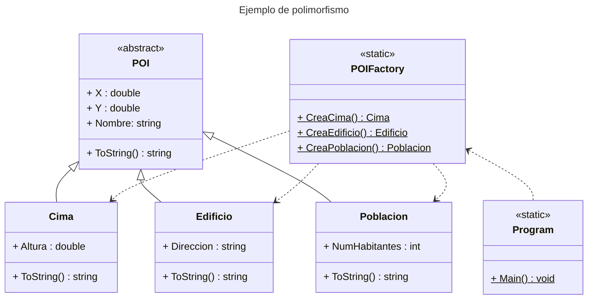

# POIS - Points of Interest

Es un ejemplo de polimorfismo en C#.

```mermaid
---
title: Ejemplo de polimorfismo
---
classDiagram
	class POI {
	<<abstract>>
    	+ X : double
    	+ Y : double
    	+ Nombre: string
    	+ ToString()  string
	}
	class Cima {
		+ Altura : double
		+ ToString()  string
	}
	class Edificio {
		+ Direccion : string
		+ ToString()  string
	}
	class Poblacion {
		+ NumHabitantes : int
		+ ToString()  string
	}
	
	POI<|--Cima
	POI<|--Edificio
	POI<|--Poblacion
	
	class Program {
		<<static>>
		 + Main()  void$
	}
	
	POIFactory<..Program
	POIFactory..>Cima
	POIFactory..>Edificio
	POIFactory..>Poblacion
	
		class POIFactory {
		<<static>>
		+ CreaCima()  Cima$
		+ CreaEdificio()  Edificio$
		+ CreaPoblacion()  Poblacion$
	}


```
